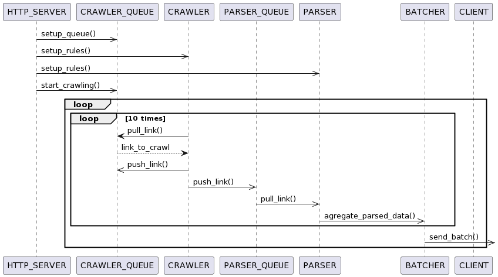

# Extension-for-adaptive-web-scraping

The project presents Licence Thesis for the Technical University of Moldova by Osadenco Alexandru and Maxim Voloșenco.
Project is separated in 2 main entities: Scraper itsel written in Erlang programming language and the services which gives the user the possibility to choose what data is needed to scrape.

## Scraper

Scraper is written in Erlang language. Erlang language solves concurency not by threading, but by actor model. One actor model process cost at start around 600 bytes when one .NET thread costs 1 MB at start.

The diagram 1.1 shows how the communication between entities is happening inside the system.
